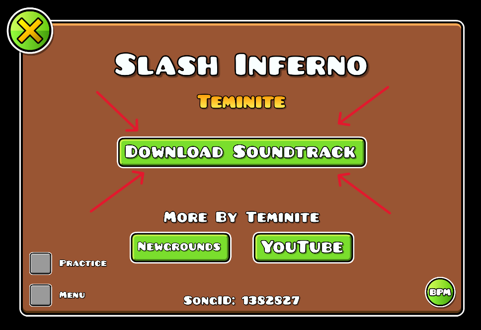

# ActuallyDownloadSoundtrack
Download Newgrounds song by direct link!

# What does this mod?
Have you ever tried to click "Download soundtrack" in song info menu?

This button redirects you to the [Newgrounds](https://www.newgrounds.com/) song page.

But this mod makes this button redirect to a <strong>direct link</strong> for the song as .mp3 file [(Example)](https://audio.ngfiles.com/723000/723714_Epilogue.mp3)

This also works with songs that hosted on Robtop's servers (like [music by Acid-Notation](https://geometrydashcontent.b-cdn.net/songs/708694.mp3))